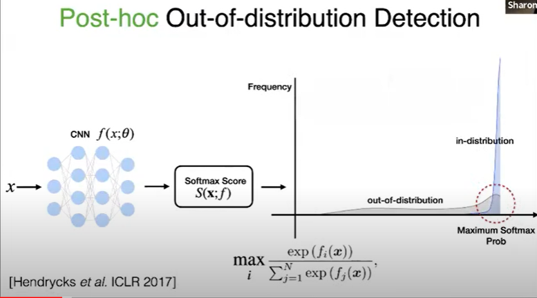
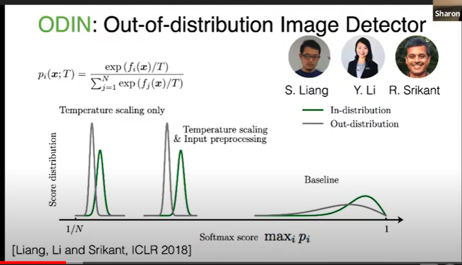
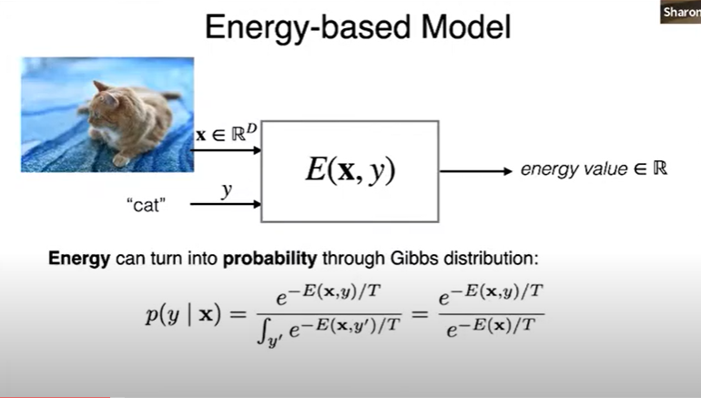
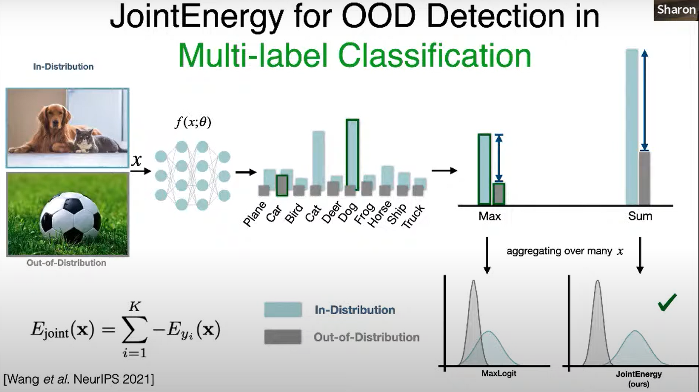
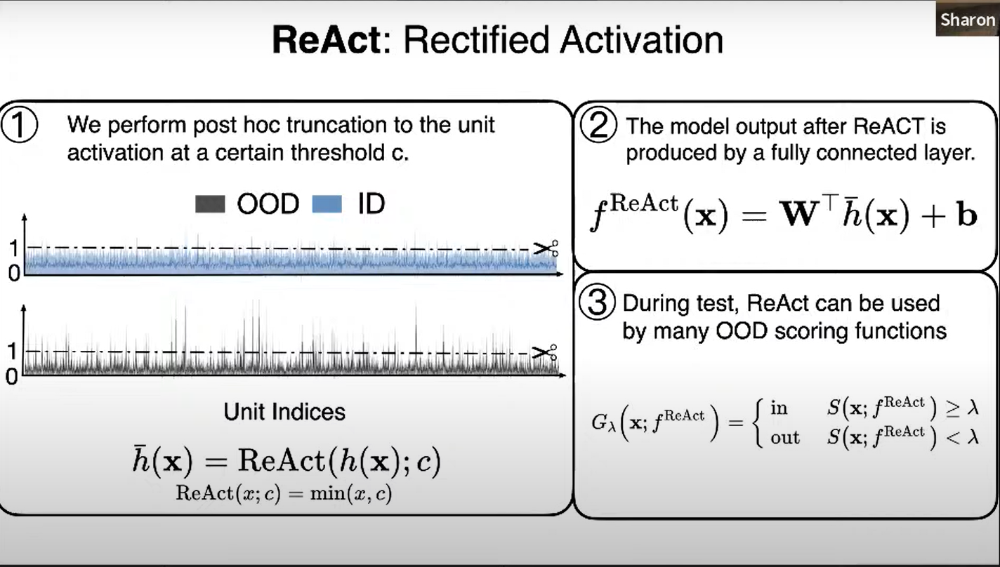
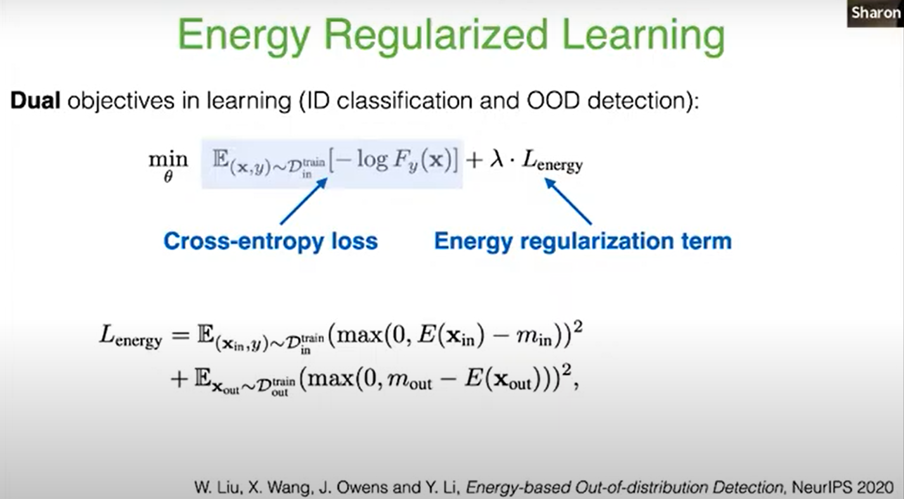
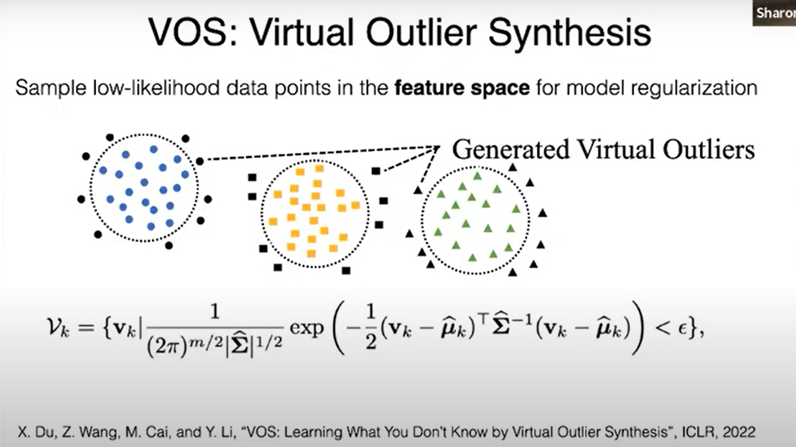
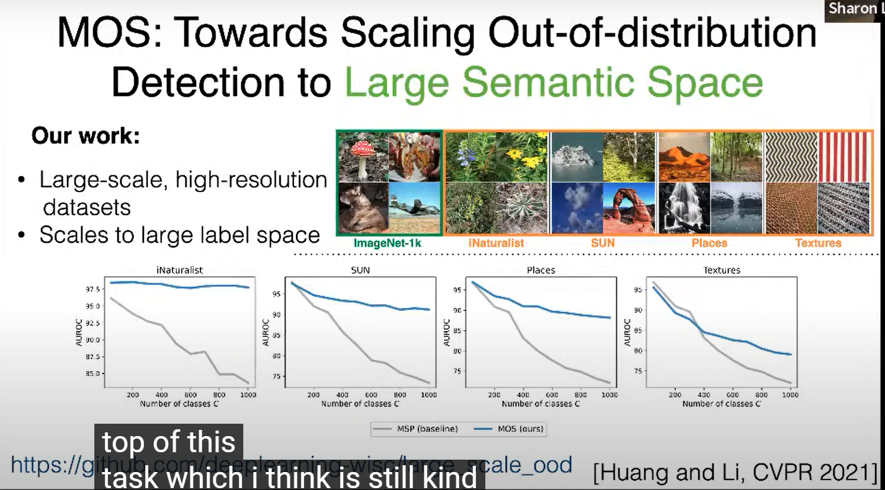
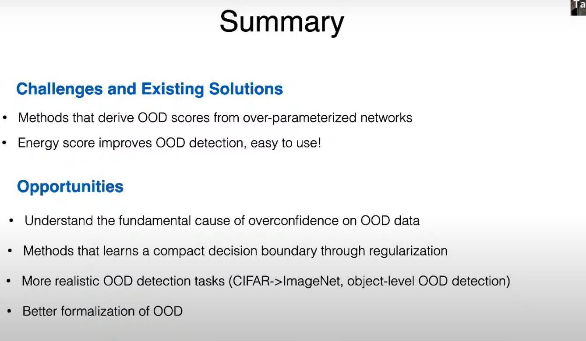

### *The Challenge in OOD*

上面那个说，高容量的神经网络加剧了过度自信的预测（其实也就是说，决策边界有可能把一类OOD分到了在数据集中的一类，比如说图中的红色被分到了橙色中）

------

解决OOD的传统方法：

- **post-hoc**: 用一个网络计算softmax score，大于阈值的保留，小于阈值的丢弃。难点在于**阈值的确定**。

  

- ODIN： 使用temperature scaling and input processing让softmax score更seperable

- **Energy-based model**:  energy公式计算的是x和label y的适配性，适配性越高，energy得分越低。它的好处是，产生的energy可以代替上面的softmax score，具有更好的区分性，能够更好找到threshold。

- **jointEnergy**（不s太了解）

------

ReAct： 探究了OOD对神经网络的影响，并提出截断式

对score的改进（对损失函数的改进）：

- **ReAct**： 探究了OOD对神经网络的影响，并提出截断式

- **Energy Regularized** : 双目标：一个是分类目标，用的是普通的交叉熵；一个是energy，用来尽可能地区分ID和OOD。

------

- VOS：采用生成样本式，生成一些outlier，为了robust detect! 

- 关于分辨率的研究

Summary:

