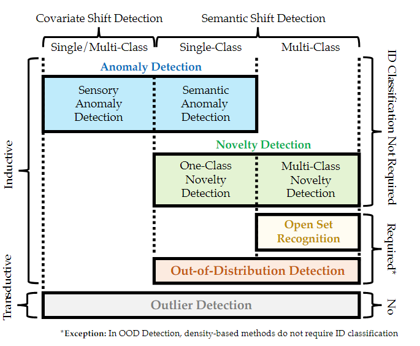
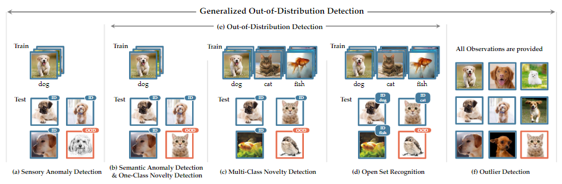

## *Generalized Out-of-Distribution Detection: A Survey*

1. **全文的框架**

**介绍了5种相近的问题种类：**

- AD: Anomaly Detection
- ND: Novelty Detection
- Open Set Recognition
- Out-of-Distribution Detection
- Outlier Detection

本文还提出了两种导致OOD的原因：semantic shift（来自不同的种类）和 covariate shift（来自不同的领域）

2. **解决OOD的四类方法：**

- density-based
- reconstruction-based
- classification-based
- distance-based

3. **对于5类问题的区分：**

- AD

  - Sensory AD

    只包含covatiate shift，有covariate shift 会被认为是OOD，而且对于ID没有进一步的识别。

  - Semantic AD & 1-class ND

    只包含semantic shift，只识别一类图片，而且对ID没有进一步的识别

  - Multi-class ND

    和上一个差不多，但需要识别多类图片，对ID没有进一步识别

  - OST

    和上一个差不多，但对ID有进一步的识别

  - OOD

    包含了前三类（不包含covariate shift），且对ID有进一步的识别。

  - OD

    不符合train test scheme，包含所有的分布，而且会把占绝大多数的分布认为成ID。

4. **对于OOD问题的一般方法：**

- output-based method
  - post-hoc: 计算出一个分数、能量，等等，进行划分。但模型训练过程可以不改变
  - confidence enhancement: 隐变量的表示，更好建模density
  - outlier exposure: 用一部分“外点”，在训练阶段让模型学习ID和OOD之间的差异。用outlier的方式能够获得更好的模型表现。常用方法：伪标签、ID过滤器等等。。
  - 
